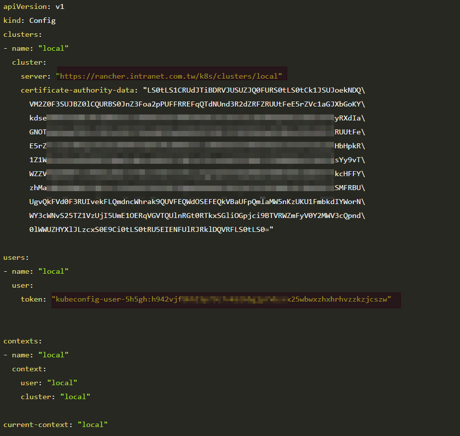

# 安裝Argo

## 安裝Argo CD

```
kubectl create namespace argocd
kubectl apply -n argocd -f https://raw.githubusercontent.com/argoproj/argo-cd/stable/manifests/install.yaml
```

## 下載Argo CD CLI

```
VERSION=$(curl --silent "https://api.github.com/repos/argoproj/argo-cd/releases/latest" | grep '"tag_name"' | sed -E 's/.*"([^"]+)".*/\1/')
curl -sSL -o /usr/local/bin/argocd https://github.com/argoproj/argo-cd/releases/download/$VERSION/argocd-linux-amd64
chmod +x /usr/local/bin/argocd
```

## ingress

```
cat <<EOF | kubectl apply -f -
apiVersion: extensions/v1beta1
kind: Ingress
metadata:
  name: argocd-server-ingress
  namespace: argocd
  annotations:
    kubernetes.io/ingress.class: nginx
    kubernetes.io/tls-acme: "true"
    nginx.ingress.kubernetes.io/force-ssl-redirect: "true"
    nginx.ingress.kubernetes.io/ssl-passthrough: "true"
    nginx.ingress.kubernetes.io/backend-protocol: "HTTPS"
spec:
  rules:
    - host: argocd.172.31.230.24.nip.io
      http:
        paths:
          - backend:
              serviceName: argocd-server
              servicePort: https
  tls:
    - hosts:
        - argocd.172.31.230.24.nip.io
      secretName: argocd-tls-secret

EOF

```


## 取得ArgoCD admin密碼

```
kubectl get pods -n argocd -l app.kubernetes.io/name=argocd-server -o name | cut -d'/' -f 2

## 出現的東西即是密碼
argocd-server-656f9b895b-bfjvw
```


## 登入並修改 密碼

```
## 先port-forward 如果直接連ing 會出現UTF8問題
kubectl port-forward svc/argocd-server -n argocd --address 0.0.0.0 8080:443

## 取得密碼
kubectl get pods -n argocd -l app.kubernetes.io/name=argocd-server -o name | cut -d'/' -f 2
argocd-server-656f9b895b-bfjvw

## 登入
argocd login 127.0.0.1:8080

## 修改密碼
argocd account update-password

## 變更密碼
argocd account update-password
*** Enter current password: 
*** Enter new password: 
*** Confirm new password: 
```


## 修改argo 所使用的sa權限

+ 預設值只能在default 的namespace 裡面活動
+ 執行下面指令會將現在的kube config 裡關於 kube-system 的權限綁定給 此sa使用 (如果你正在登入的權限為cluster-admin, 此時argo的sa 也會同樣取得此ClusterRole)

```
## local 為kubeconfig 內的 CONTEXTNAME
argocd cluster add local

### 會發現報錯誤 因為我們用的是rancher 的kube api
INFO[0000] ServiceAccount "argocd-manager" created in namespace "kube-system"
INFO[0000] ClusterRole "argocd-manager-role" created
INFO[0000] ClusterRoleBinding "argocd-manager-role-binding" created
Handling connection for 8080
FATA[0001] rpc error: code = Unauthenticated desc = the server has asked for the client to provide credentials

## 解決辦法在下面
### 裡面相關資訊從rancher 的的kubeconfig取得
https://gist.github.com/janeczku/b16154194f7f03f772645303af8e9f80

apiVersion: v1
kind: Secret
metadata:
  name: mycluster-secret
  labels:
    argocd.argoproj.io/secret-type: cluster
type: Opaque
stringData:
  name: mycluster.com
  server: https://mycluster.com
  config: |
    {
      "bearerToken": "<authentication token>",
      "tlsClientConfig": {
        "insecure": false,
        "caData": "<base64 encoded certificate>"
      }
    }
## ===========================================

cat <<EOF | kubectl apply -f -
apiVersion: v1
kind: Secret
metadata:
  name: rancher-secret
  namespace: argocd
  labels:
    argocd.argoproj.io/secret-type: cluster
type: Opaque
stringData:
  name: rancher.local
  server: https://rancher.intranet.com.tw/k8s/clusters/local
  config: |
    {
      "bearerToken": "kubeconfig-user-5h5gh:h942vjfbhhl9p79c7vk626bXXXXXXXXXXXXXXXXrhvzzkzjcszw",
      "tlsClientConfig": {
        "insecure": true
      }
    }
EOF
```



### 如果要透過cli 工具不能經過ingress, 透過port-forward或是 svc直接打出來

#### 建立一個project app

```
argocd app create guestbook --repo  https://github.com/harryliu123/argocd-example-apps --path guestbook --dest-server https://kubernetes.default.svc --dest-namespace test
```

#### 設定sync policy

```
## --self-heal 會自動比對同步 30秒同步一次
argocd app set guestbook --sync-policy automated --auto-prune --self-heal \
                         --self-heal-timeout-seconds 30
```


連線到UI: https://argocd.172.31.230.24.nip.io

----


# 測試流程

## 複製git 範例

+ 再登入自己的github 
+ 連線到下面的範例網址  https://github.com/harryliu123/argocd-example-apps
+ 按下右上角的 Fork 取得網址 https://github.com/yourname/argocd-example-apps
+ 修改 guestbook/guestbook-ui-ingress.yaml 裡面的網址: guestbook.tradevan-rd.com


## 透過cli佈署測試project (當然也可以透過UI執行)

+ path 為 guestbook
+ 由於 argo 所佈署的k8s 和 guestbook 為同一座k8s 所以 kube api為https://kubernetes.default.svc
+ 將服務佈署在 default的 namespace上

```
argocd app create guestbook --repo  https://github.com/yourname/argocd-example-apps --path guestbook --dest-server https://kubernetes.default.svc --dest-namespace default
```

連線 http://guestbook.tradevan-rd.com  即可看到網頁


## 在Git 上變更狀態看是否有改變

### 查看 目前狀態

```
$ kubectl get po
NAME                            READY   STATUS    RESTARTS   AGE
guestbook-ui-85c9c5f9cb-fdc97   1/1     Running   0          14h
```

### git 上修改guestbook-ui-deployment.yaml

```
...
spec:
  replicas: 3  --> 原本1改為3
...

```

### 再查看狀態

```
$ kubectl get po
NAME                            READY   STATUS              RESTARTS   AGE
guestbook-ui-85c9c5f9cb-7vw7w   0/1     ContainerCreating   0          4s
guestbook-ui-85c9c5f9cb-fdc97   1/1     Running             0          16h
guestbook-ui-85c9c5f9cb-kgqrh   0/1     ContainerCreating   0          4s
```


## 建立slack 通知
```
## 先到slack 註冊
### 註冊網址
https://api.slack.com/apps?new_app=1

### 參考文件
https://argoproj-labs.github.io/argocd-notifications/services/slack/


## 安裝 argocd-notifications
helm repo add argo https://argoproj.github.io/argo-helm
helm install --namespace argocd argo/argocd-notifications --generate-name \
    --set triggers[0].name=on-sync-succeeded \
    --set triggers[0].enabled=true \
    --set secret.notifiers.slack.enabled=true \
    --set secret.notifiers.slack.token=<slack token>
```
